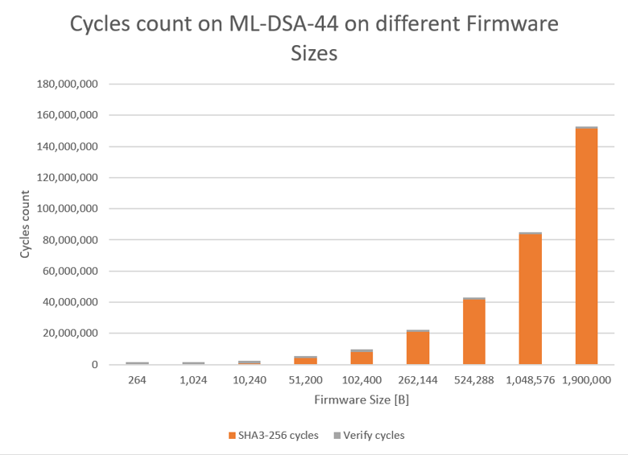
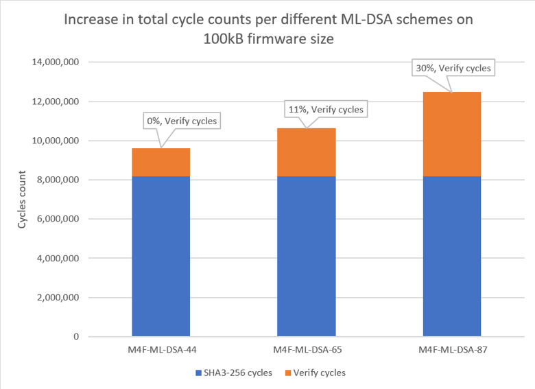
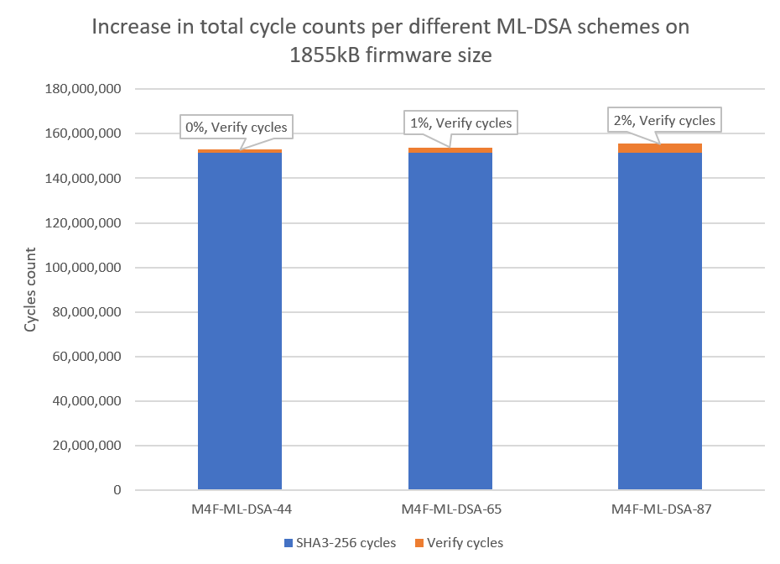
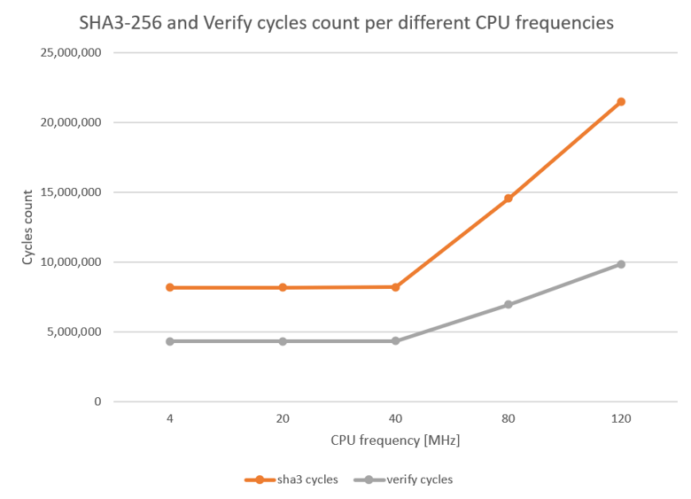

# Hashing, not the signature, dominates post-quantum secure boot on an ARM Cortex-M4

A hardware-measured evaluation of ML-DSA (Dilithium) verification cost across security levels, firmware sizes, and CPU frequencies

## Intro

As transition to post-quantum cryptography schemes poses challenges to systems of all types, from governmental institutions to banking and investment companies, interest is rising in embedded systems, too. Known for their stringent constraints in compute, memory and power resources, the adoption of new high-compute and high-size algorithm needs to be preceded by deep evaluations and analysis of what the best fit solution is.

August 2024 brought the [approval by NIST](https://csrc.nist.gov/news/2024/postquantum-cryptography-fips-approved) of 3 quantum-resistant cryptography standards: FIPS 203 (Module Lattice Key-Encapsulation-Mechanism) for key encapsulation mechanism, FIPS 204 (Module Lattice Digital Signature Algorithm) and FIPS 205 (Stateless Hash Digital Signature Algorithm) for digital signatures. Module lattice cryptography is a form of public-key cryptography based on the hardness of high-dimensional module lattice problems.
For FIPS 204 ML-DSA in particular, NIST standardized 3 levels of this algorithm, namely:

•	**ML-DSA-44** based on 4 by 4 matrix, public key of 1312 bytes, secret key of 2560 bytes and signature of 2420 bytes.

•	**ML-DSA-65** based on 6 by 5 matrix, public key of 1952 bytes, secret key of 4032 bytes and signature of 3309 bytes.

•	**ML-DSA-87** based on 8 by 7 matrix, public key of 2592 bytes, secret key of 4896 bytes and signature of 4627 bytes.

Comparing these parameters to the ones of classical asymmetric, non-quantum resistant algorithms like Ed25519, with key size of 32bytes and signature size of 64 bytes, one can see a first jump in system requirements needs of ML-DSA. The following increases in system requirements needed deeper analysis and work so this is why I prepared this evaluation below.

## Measurements & Analysis
I took the example target of this ARM Cortex M4 core based on its usage in embedded projects.
Benchmarks published in the [pqm4](https://github.com/mupq/pqm4) repo, ran on ARM Cortex M4, offer insightful information on the performance of all operations on ML-DSA: key generation, sign, verify.  What I wanted to measure in addition, was the performance of the entire chain, ML-DSA included, in the use-case of embedded secure boot.

Making use of the **m4f**, the optimized for execution speed implementation, from the aforementioned pqm4 repo, I built the boot + app + signing tool environment in [pqc_secure_boot_benchmarking](https://github.com/Badarant/pqc_secure_boot_benchmarking).
What this repo is implementing is a way to build a secure boot binary with selectable variant of ML-DSA, running at selectable CPU frequencies, and verifying different sized signed applications. The signature of the application is calculated by signing with ML-DSA the **SHA3-256** hash over the firmware header and firmware binary.

The environment is designed for and tested on the Nucleo L4R5ZI development board, one of the development boards used also in the aforementioned pqm4. This board being available with a 2MB flash, the evaluation was done on different app sizes ranging from 264B (the size of a simple app with a blinking LED on Nucleo) to 1855kB (artificially padded binary file). The RAM size of this board is 640kB.

The chosen ML-DSA implementation from pqm4 is **m4f**, considering the most critical resource of a secure boot is execution time. The other implementations of:

•	m4stack: I would consider not relevant for the use-case of a boot, because the stack in this case can be dimensioned over most of the RAM, since there is no application running yet in the same time, competing for the same RAM;

•	clean: is great for its portability property, but not relevant for a performance evaluation dedicated to ARM Cortex M4.

So the trade-off is having fast execution time over stack size. First measurement done was on stack usage during signature verification, with the following results:

| Scheme      | Stack Usage [kB]    |
| ----------- | -----------         |
|M4F-ML-DSA-44| 8.9                 |
|M4F-ML-DSA-65| 9.9                 | 
|M4F-ML-DSA-87| 11.9                |

This maximum usage of M4F-ML-DSA-87 does fit comfortably in the RAM space of most of the microcontrollers available with M4, however there are also microcontrollers with less than the RAM needed for ML-DSA-44 alone.

The next step was to measure the execution cycles of the two parts, SHA3-hashing and ML-DSA-verification, respectively, initially at the CPU frequency of 4MHz, for the minimum application size of 264B.

|Scheme	| SHA3-256 cycles |	verify cycles |	SHA3-256 time [ms] | verify time [ms] |	total time [ms] |
| ------| ----------------|---------------|--------------------|------------------|-----------------|
 M4F-ML-DSA-44|	33,265|	1,450,496|	8|	363|	371|
 M4F-ML-DSA-65|	33,265|	2,479,925|	8|	620|	628|
 M4F-ML-DSA-87|	33,265|	4,309,893|	8|	1,077|	1,086|

The verify cycle counts align with pqm4's benchmarks within ~2% deviation; the small difference comes from the surrounding secure-boot overhead (header parsing, function call) and pqm4 averaging over 1000 executions, while ML-DSA verify is deterministic so a single measurement suffices here.
The progression in the number of verify cycles through the ML-DSA schemes is nothing new, it is already benchmarked by pqm4 (at CPU frequency of 24MHz). What this table intends is to put them also next to the hashing cycles, for better perspective.
What happens with different firmware sizes, though? Surely in the field having a 264B firmware is highly unlikely. The following graph shows the progression of the SHA3 and ML-DSA verify cycles through 10 different application sizes:

Cycles count on ML-DSA-44 on different Firmware Sizes

This chart does not intend to show the proportionality of a calculation time on bigger and bigger data, but to show how insignificant the ML-DSA verification time becomes compared to the SHA3-256 hashing over this bigger data. It can be seen that already at a point between 10kB and 50kB of firmware size, the cycle count of SHA3-256 exceeds twice the count of ML-DSA verification.
Further, if you pivot around a specific firmware size above this turning-point range, the increase in verify cycle counts from ML-DSA-44 to ML-DSA-87 represents only a small fraction of the total hashing and verification time of the minimum ML-DSA-44, and this gets smaller as the firmware size gets bigger. But the gain in security level is significant, from NIST Level 2 to NIST Level 5.

This last chart is to be read as following: if you have to choose between any ML-DSA scheme to sign and verify your firmware of around 1855kB, running at a CPU frequency that triggers no wait-states for reading the memory, the cost of choosing the highest level through ML-DSA-87 is only of 2% extra cycles count, 3kB extra stack usage and 1kB extra Flash usage for the increase in signature.
In the likely case that your specific firmware size is not close to this 1855kB, but smaller, the following graphic shows the approximate evolution of the percentage extra cycles count per different firmware sizes:

![Percentage of cycles count increase per ML-DSA scheme relative to base ML-DSA-44, different firmware sizes [B]](pictures/Percentage_MLDSA_different_FWsizes.png)

Now you may notice a point mentioned for the first time in this discussion, inside the highlighted conclusion above. The measurements presented here so far, just like in the benchmarking from pqm4, are performed at a clock frequency that does not trigger any wait-states for reading the memory. But what is the impact on SHA3 and verify cycle counts when increasing the frequency? The following graphic shows the extra wait-cycles introduced in both SHA3-256 calculations and in the ML-DSA verification, when performed on the same size of a firmware:

One would wonder then about the benefit that CPU frequency increase would bring in the total execution time of a secure boot with SHA3-256 and ML-DSA.
When converting the cycles to time units, it can be seen that higher than 40MHz, the total execution time improvements diminish due to the extra wait-cycles introduced, making the cost per benefit ratio very high.

![Total time (SHA3+verify) on a 100kB firmware at different CPU frequencies [ms]](pictures/Total_Time_100kB_different_frequencies.png)

This evaluation is done with a purely lab-test-like implementation of a secure boot. In no way is this a production solution, not only due to the current design of it, but also due to different requirements like crypto-agility, immutability, keys rotation, anti-rollback protection which are not part of this current implementation. Such requirements are as important as choosing the right level of cryptography algorithm, but belong to discussions of their own.

Current present measurements are performed on successful verification tests, where the signature verification passes. The verification takes the same number of cycles whether the signature is authentic or not, a constant-time property relevant against timing side-channels.

SHA3-256 is used for the firmware digest because ML-DSA already includes Keccak (SHAKE) internally. On an M4 without a dedicated hardware accelerator, SHA2-256 would be faster and could reduce the (dominant) hashing cost on large firmware, at the same security level, though ML-DSA still mandates Keccak internally, so this optimizes only the digest, not the verification. A full evaluation with SHA2-256 is left as future work.

All data measured for this analysis can be found in [CSV format, here.](https://github.com/Badarant/pqc_secure_boot_benchmarking/blob/main/docs/benchmark_all_data.xlsx)

## Conclusions

•	For realistic firmware sizes, SHA3-256 hashing dominates total boot time, not ML-DSA verification, and this cost is common to both classical and PQC signatures, not specific to post-quantum

•	Above the turning-point size, choosing the highest security level (ML-DSA-87, NIST Level 5) costs from 30% down to only 2% extra time but 1 kB extra signature size; the real trade-off is Flash size versus security, not time versus security

•	Raising CPU frequency gives diminishing returns: flash wait-states above ~20 MHz erode the speed-up, flattening boot time above 40 MHz

## Author

Liviu Silaghe liviu.silaghe@gmail.com 

## References
1.	Matthias J. Kannwischer and Richard Petri and Joost Rijneveld and Peter Schwabe and Ko Stoffelen. "PQM4: Post-quantum crypto library for the ARM Cortex-M4." [https://github.com/mupq/pqm4](https://github.com/mupq/pqm4)

2.	NIST. Post Quantum Cryptography FIPS Approved [https://csrc.nist.gov/news/2024/postquantum-cryptography-fips-approved](https://csrc.nist.gov/news/2024/postquantum-cryptography-fips-approved)

3.	NIST. FIPS 202: SHA-3 Standard. 2015. [https://csrc.nist.gov/pubs/fips/202/final](https://csrc.nist.gov/pubs/fips/202/final)

