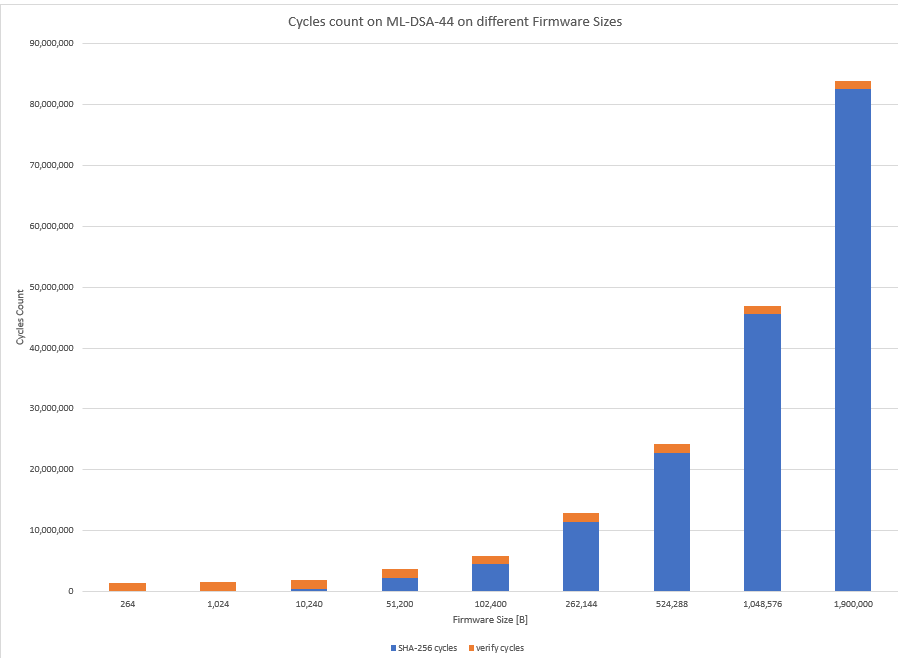
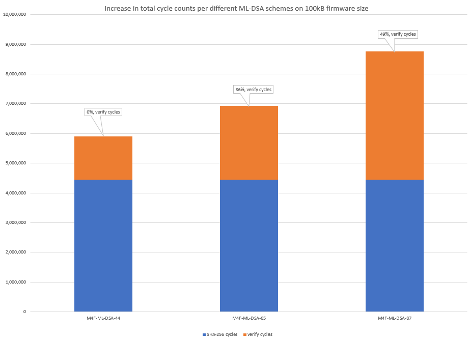
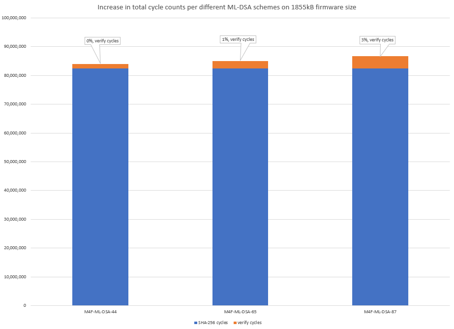
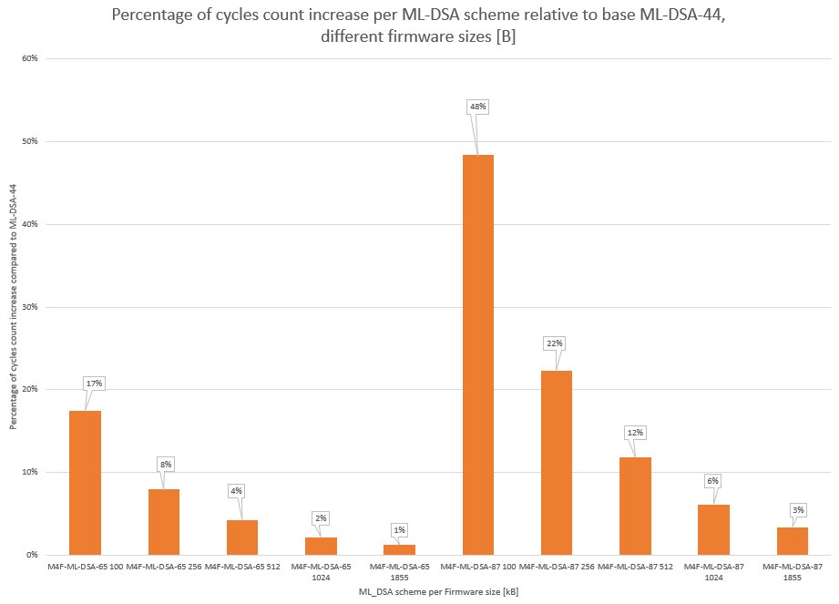
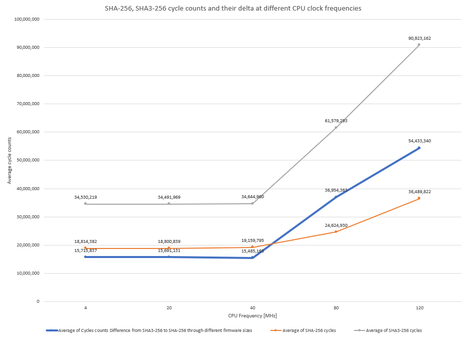
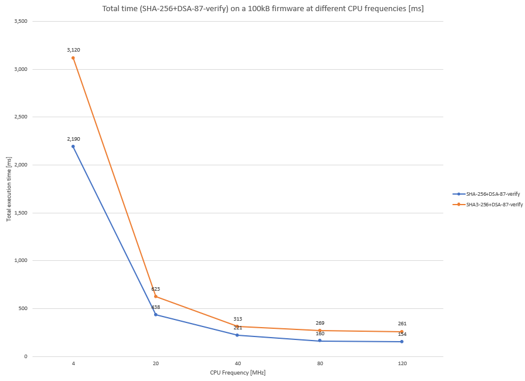

# SHA-256, the pragmatic choice for hash to use with post-quantum secure boot on an ARM Cortex-M4

A hardware-measured evaluation of SHA-256 hashing used with ML-DSA (Dilithium) secure boot verification cost across firmware sizes and CPU frequencies

## Intro

With the previous page I wrote on PQC secure boot evaluation on an ARM Cortex M4, I concluded on how the SHA3-256 hashing algorithm dominates the execution time versus the verification with ML-DSA signature. The choice of SHA3-256 as the hashing algorithm was driven by the intention to evaluate the FIPS-204 standard from both the digital signature verification and the one digest calculation that it also includes. Due to the conclusions related to the hashing performance, the alternative of using the SHA2 family SHA-256 algorithm instead, with the same level of security, had to be evaluated as well.

SHA-256 hashing algorithm is standardized by NIST under [FIPS 180-4](https://csrc.nist.gov/pubs/fips/180-4/upd1/final), together with 5 other variants of the algorithm forming the SHA2 family of hashing algorithms.
Despite having different mathematical basis compared to the newer SHA3-256, the older SHA-256 is still considered secure. Both provide a 128-bit security level against collisions, with a 256-bit digest sufficient for all three ML-DSA levels.

Due the method of forming the hashing output, SHA-256 is vulnerable to length extension attacks. However, this attack is not relevant in the secure boot use-case, as the presumably length-extended hash will still be verified through the digital signature and this verification will fail, rejecting such a length-extended firmware and hash.

## Measurements & Analysis

For this evaluation, I used the SHA-256 (sha2.c, sha2.h) implementation from the same repo, [pqm4](https://github.com/mupq/pqm4), that I used also for the SHA3-256+ML-DSA chain evaluation. The SHA-256 implementation is therefore a clean C implementation, as it is available there. The following comparison to the assembly optimized SHA3-256 implementation will therefore show only partly the achievable performance improvement with SHA-256. Further optimizing the SHA-256 in assembly for ARM Cortex M4, will pose further improvenents.

Adding the SHA-256 hash instead of the SHA3-256 does increase the boot code size by around 7kB (from 18kB in the SHA3-256 variant to 25kB with SHA-256), due to the fact that the SHA3-256 algorithm is still being used in the ML-DSA algorithm, so this is not replaced from code memory, only from hashing.
Total stack size during the hashing+verify chain remains unchanged compared to SHA3-256, because still the longer call stack is needed by the signature verification, not the hashing, in both cases.

Measuring the cycles count with SHA-256 and ML-DSA-44, on different firmware sizes at 4MHz CPU frequency, it is visible that my previous conclusion still stands: SHA-256 hashing duration still dominates the ML-DSA verification duration, for realistic firmware size, that are above 10kB. What is visible is a shift to the right, from the 10kB-50kB range with SHA3-256, to the range 50kB-100kB with SHA-256, of the point where the hashing exceeds twice the count of ML-DSA verification cycles.

Pivoting around the same 100kB firmware size as in the previous SHA3-256 analysis, you can see the cost in verify cycles for switching from ML-DSA-44 (0%) to ML-DSA-65 (+36%) or ML-DSA-87 (+49%):

When comparing for a much bigger firmware size, this cost increase does still diminish considerably, to only 3% for switching from ML-DSA-44 to ML-DSA-87.

In the likely case that your specific firmware size is not close to this 1855kB, but smaller, the following graphic shows the approximate evolution of the percentage extra cycles count per different firmware sizes between SHA-256 and ML-DSA:

Comparing the cycles count for SHA-256 to SHA3-256, at CPU frequencies that do not trigger memory wait-cycles in the algorithm execution, it is seen that SHA-256 is around 2.2 times faster than SHA3-256, even with the mentioned clean C implementation of SHA-256. Moving CPU frequencies above the threshold that introduces the wait-cycles, measurements reveal that SHA-256 algorithm on ARM Cortex M4 is introducing less wait-cycles than SHA3-256. At the maximum frequency allowed by my evaluation board Nucleo L4R5ZI, the improvement is reaching a 2.5 factor. This is due to the smaller size in state (256bits) that SHA-256 implements, compared to the SHA3-256 based on the Keccak state (1600bits, therefore more memory accesses).

For the entire hashing+verification chain, the chart below shows the overall time reduction when using SHA-256 compared to SHA3-256, at different CPU frequencies, for a firmware size of 100kB.

All data measured for this analysis can be found in [XSLX format, here.](https://github.com/Badarant/pqc_secure_boot_benchmarking/blob/main/docs/benchmark_all_data.xlsx)

## Conclusions

1.	Execution time of the hashing with SHA-256 still dominates the signature verification with ML-DSA, even for the ML-DSA-87 scheme, allowing for the similar low extra cost (down to 3% with SHA-256) in execution time for switching to highest security level ML-DSA-87 scheme.
2.	Choosing SHA-256 (pure C) instead of the SHA3-256 (hand-written assembly) does offer improvements in overall execution time with up to 41% (at 120MHz), so an assembly implementation of SHA-256 would even widen the gap. Current cost is increased Flash size (+7kB). The maximum stack usage remains unchanged compared to SHA3-256.
3.	SHA-256 algorithm triggers less wait-cycles introduced at higher CPU frequencies, compared to SHA3-256.

## References

1.	Matthias J. Kannwischer and Richard Petri and Joost Rijneveld and Peter Schwabe and Ko Stoffelen. "PQM4: Post-quantum crypto library for the ARM Cortex-M4." https://github.com/mupq/pqm4
2.	NIST FIPS 180-4 standard https://csrc.nist.gov/pubs/fips/180-4/upd1/final
3.	NIST. FIPS 202: SHA-3 Standard. 2015. https://csrc.nist.gov/pubs/fips/202/final
4.	NIST. FIPS 204 ML-DSA https://csrc.nist.gov/pubs/fips/204/final
