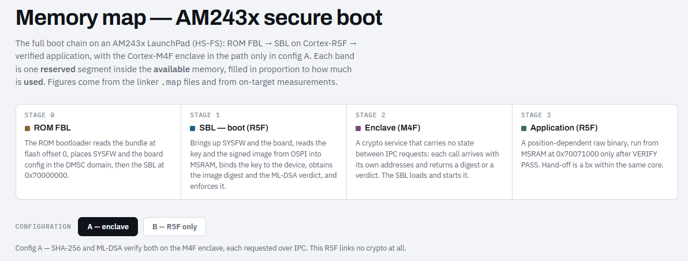

# Evaluation of boot verification on an ARM Cortex R5F + ARM Cortex M4F SoC

## Introduction

After my previous evaluations of SHA hashing and ML-DSA digital signature algorithms software implementations on the Arm Cortex M4, I wanted to continue evaluations in the context of secured-booting, on other Arm Cortex families. I was interested in the performance on Arm Cortex R family, one designed for real-time, safety-related and high-throughput applications. This family is the regular choice for safety related applications.
The evaluation board that I took for this reason is the Texas Instruments AM243 general purpose Launch Pad [1]. It features the AM2434 ALX microcontroller unit, that lists these processors and sub-components relevant for the context of my research:

-	1x ARM Cortex M4F processor running at up to 400MHz
-	2x Dual-core ARM Cortex R5F processors running at up to 800MHz
-	1x HW accelerator for security algorithms such as SHA256
-	64MiB QSPI flash (on-board AM243 LP)
-	2MiB RAM (on-chip AM2434 ALX MCU)

The boot chain of the AM2434 MCU implements a multi-stage approach [2]:
-	The ROM bootloader (RBL) is immutable masked ROM, written during chip production. The RBL implements classical public key authentication for authenticating the next stages, when it runs on a High Security, Security Enabled (HS-SE) device type. For High Security – Field Securable (HS-FS) device type, as it is the case on my evaluation board, the RBL does optionally only the next-stages Image Integrity check, but does not enforce the security certificate verification.
-	System Controller Firmware (SYSFW) responsible of resource and power management before the next stage can run. It powers up the first R5F core.
-	The secondary bootloader (SBL), the last boot stage, is handed control to by the RBL, after its operations, dependent on device type, are verified. At this level, the user software can control how the application image authentication and integrity is verified.

It is important to note the scope of this evaluation. A fully post-quantum secure boot chain with the above conditions can not be met, not even in HS-SE devices. It would require the root of trust (the immutable RBL) to itself use post-quantum signature verification. Like the vast majority of current-generation MCUs, the AM2434 boot ROM uses classical asymmetric cryptography, as these devices predate the standardization of post-quantum schemes. This evaluation therefore covers post-quantum verification in the SBL stage that the user controls, not the ROM-based root of trust. A complete post-quantum boot chain will require silicon with a PQC-capable immutable root of trust, an industry-wide transition still in progress.

Based on the conclusions from the previous evaluations of post-quantum secure-boot that I found, I follow in this new evaluation only the SHA256 algorithm for hashing and ML-DSA-87 scheme for signature. I intentionally exclude the more computation demanding SHA3-256 hashing that can be replaced by SHA256 without compromising the security level. I excluded also the lower security level ML_DSA-44 and ML-DSA-65 schemes (that offer lower security levels, at only a marginal performance cost saving).
It is important to mention from the start that the SBL should be orchestrated, in any case, by the first R5F core, since this is the SBL entry point from RBL/SYSFW. But after that, the deployment options for the steps needed in the secure chain of verification of the application (namely SHA256 hashing and ML-DSA-87 verification) include both R5F and M4F cores, and HW accelerator for SHA256 hashing. My focus in this article is strictly on SW solutions only, leaving evaluation of the HW accelerator for a future write.

## Configuration A for SBL

The first architectural deployment option that I tried uses the M4F core as the compute enclave for the SHA256 hashing and the ML-DSA-87 signature verification. 
This deployment option is basically a modified re-run of my previous evaluation on ARM Cortex M4, but with the application image reading being done by the R5F and the decision on app validity and jump-to-app decision being made by the R5F. The SHA256 is the clean, C-source code from mupq/pqm4/mupq/common/sha2.c [3], while the ML-DSA-87 verification comes from the m4f-speed optimization of the same repo mupq/pqm4/tree/master/crypto_sign/ml-dsa-87 [3].
Communication between the R5F and M4F is performed via Inter Processor Communication (IPC) that is based on the shared memory area in SRAM.
The SBL on R5F will firstly read the public key from Flash. It will then request the M4F enclave to calculate the SHA256 over this public key and the digest will be returned to R5F for comparing to what would be, in a HS-SE device, the e-Fused hash values of a trusted public key. Given the level of evaluation that I am performing here, there are no e-fuses burnt on my device so the comparison result alone of this hash will be ignored. The hashing of the key is relevant for performance evaluation.
Next, the application header from the QSPI flash is read by R5F SBL. After header check is passed, the R5F SBL will load the application image from QSPI Flash into the SRAM area that will also be executed in case of successful verification. The SHA256 hash compute is requested by the R5F to the M4F enclave. The resulted digest is received by R5F and provided back to the M4F enclave, together with the public key and signature, for signature verification. The verification verdict is returned to R5F which will then jump to the application in case of successful verification.

## Configuration B for SBL

This deployment configuration makes use of the SW implementation for SHA256 from the same origin mupq/pqm4/mupq/common/sha2.c [3] that configuration A uses, but this time executes it on the R5F core. ML-DSA-87 is implemented in the C-clean implementation in PQClean repo [4] and executed on the R5F, as well. In this configuration, M4F enclave is removed, therefore no IPC is used.

## Measurements

The Flash and RAM memory (data and stack) usage was measured both statically and at runtime (stack usage) and an iterative approach was used to trim the reserved areas, accordingly. The hard constraint comes down to the size of the on-chip RAM of 2MiB, shared between R5F and M4F, that has to load the SBL and the application to be executed.

**Flash** – shared by both R5F and M4F code:

The enclave M4F reserves an 1536KiB area but uses 58KiB area in configuration A.
The ML-DSA-87 public key is 2592B by definition.
The signed app (header, signature and raw image) reserves 1332KiB (8KiB header region + 1324KiB image) and this size is driven by how much space is made available for it, after SBL and enclave allocation, out of the 2MiB of on-chip MSRAM (as described below).

**MSRAM**: shared by both R5F and M4F code

SBL code reserves 192KiB of MSRAM.
SBL data reserves 256KiB.
Adding also padding and the DMSC reserved area (128KiB), we reach a remaining area of 1324KiB of SRAM that is reserved for the app and the app will run from this area after successful verification. 
This app size of 1324KiB will be the size around which the cycles measurement will be centered on.

**Stack**:

R5F uses 1.4KiB of stack for configuration A and 91KiB of stack for configuration B, out of the reserved 128KiB from the shared MSRAM.
M4F uses 11.9KiB of stack out of the 48KiB in the separate, own IRAM/DRAM (not shared to R5F), and this is only in Configuration A.

Detailed memory map & usage for the 2 configurations are represented in this [memory map](../pictures/03/AM243x_Boot_Memory_Map.html)

**Cycles count**

All cycles count measurements were done at 800MHz clock frequency for R5F and 400MHz clock frequency for M4F. 
Compiler: ti_cgt_arm_llvm_4.0.4.LTS with -O2 optimization level. 
SDK version: 12.00.00.27 for AM243.

Detailed counts per configuration and steps, median values of 10 runs on each configuration:

| Step      | Config A cycles count & execution time    | Config B cycles count & execution time |
| ----------- | -----------         | -----------       |
|Hashing the public key (2,592 B)| 358,072 R5F (round trip)  **174,097 M4F (compute)** | **101,654 R5F (compute)**          |
|Hashing the image (1324 KiB)| 170,388,022 R5F (round trip) 85,190,263 M4F (compute)| 43,651,863 R5F (compute)         |
|ML-DSA-87 verify| 13,168,970 R5F (round trip)  **6,580,807 M4F (compute)**|**6,388,919 R5F (compute)** |        
|IPC overhead (3 round trips)| 24,730 R5F = 30.9 µs | N/A                             |
|Total on R5F| 183,915,064 = **230 ms**                | 50,142,436 = **63 ms** |
|Distribution hash / verify| 92.6 % / 7.2 %         |  87.1 % / 12.7 %   |

The total count of the passed verdict on a 1324 KiB image:

| Step      | Config A (M4F)    | Config B (R5F)      | Ratio    |
| ----------- | -----------         | ----------- | -----------         |
|SHA-256, 1324 KiB| 85,190,263 cycles / 212,976 µs  **62.8 cycles/byte**|43,651,863 cycles / 54,565µs **32.2 cycles/byte**| **1.95× cycles, 3.90× time**                 |
|SHA-256, 2,592 B| **67.2 cycles/byte** | **39.2 cycles/byte**                 |  |
|ML-DSA-87 verify| 6,580,807 cycles / 16,452 µs                |**6,388,919 cycles / 7,986 µs**| **2.92% less cycles, 51% less time**                |

The measurements above are strictly on the SBL operations for hashing and ML-DSA signature verification. The time the SBL itself needs to bring up SYSFW and the board is profiled separately by the SDK's bootloader and printed in the KPI_DATA banners, which appear before the hashing and verification stage measured here, and is dominated by starting the Flash driver. Analysis and optimization of those times are outside the scope of this article.

## Conclusions

1.	The IPC overhead for requesting computation to the M4F enclave and getting the response is neglectable: just 0.013% of the total cycles count.
2.	Running the ML-DSA-87 verification from PQClean, in clean-C implementation, on the R5F core takes approximate same cycles count as the m4f-speed assembly optimization takes on its target ARM family M4F. In real time this means 2 times faster. This comes at the cost of stack usage: 91KiB on PQClean on R5F versus 11.9KiB on m4f-speed on M4F.
3.	Running same SW implementation for SHA256 on R5F, for high payloads as the entire app image, takes around 51% of the cycles count on the M4F, almost double the speed at the same frequency. But considering the R5F clock frequency on this board is double than the M4F clock, this means a nearly 4-fold speed improvement.
4.	Running the entire SBL hashing and verification chain on the given app size of 1324KiB on the R5F alone takes 63ms, an approximate 3.7 times acceleration compared to the 230ms when M4F is used for computation. 

## Disclaimer

All measurements executed on the HS-FS variant in its default non-enforced, development board. Only the public SDK for AM243 was used for starting the board and SBL. These measurements are purely informative and educational. They are not a comparison to other boards from the same or different suppliers.

Source code for these configurations was planned and written with Claude Opus 5. Available as open source here: [boards/LP_AM243 PQC secure boot](https://github.com/Badarant/pqc_secure_boot_benchmarking/tree/main/boards/LP_AM243)

## References

[1] LP-AM243 - general purpose LaunchPad development kit for Arm-based MCU: [https://www.ti.com/tool/LP-AM243](https://www.ti.com/tool/LP-AM243)

[2] AM243X Boot Flow Guide: [https://software-dl.ti.com/mcu-plus-sdk/esd/AM243X/latest/exports/docs/api_guide_am243x/BOOTFLOW_GUIDE.html](https://software-dl.ti.com/mcu-plus-sdk/esd/AM243X/latest/exports/docs/api_guide_am243x/BOOTFLOW_GUIDE.html)

[3] SHA256 and Post-quantum crypto library for the ARM Cortex-M4: [https://github.com/mupq/pqm4](https://github.com/mupq/pqm4)

[4] Clean, portable, tested implementations of post-quantum cryptography: [https://github.com/PQClean/PQClean](https://github.com/PQClean/PQClean)
